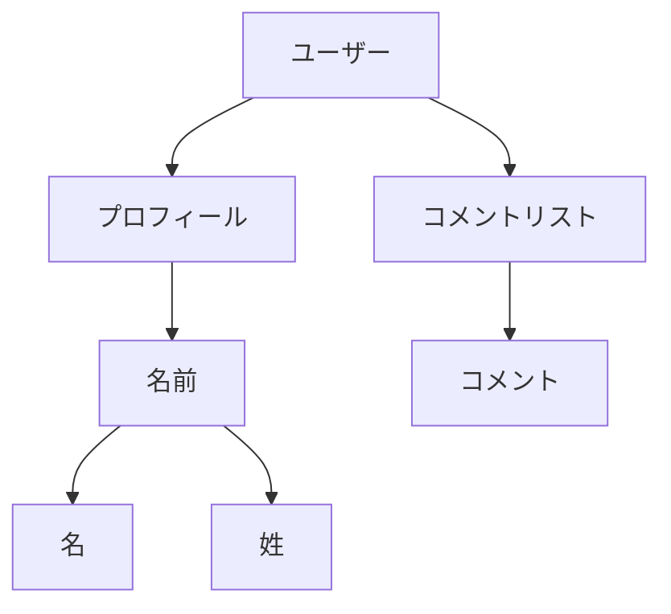
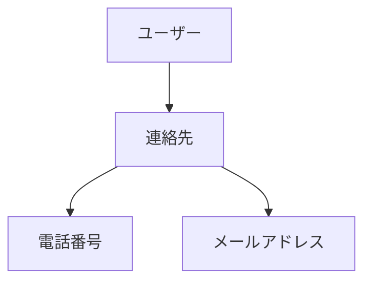

# ドメインモデル図
## ユーザー

```mermaid
flowchart TD
App\UserInterface\Object\User[ユーザー]
click App\UserInterface\Object\User "https://github.com/paterapatera/laravel-sample-1/tree/main/app/UserInterface/Object/User.php" _blank
App\UserInterface\Object\User --> App\UserInterface\Object\User\Profile
App\UserInterface\Object\User --> App\UserInterface\Object\User\CommentList
App\UserInterface\Object\User\Profile[プロフィール]
click App\UserInterface\Object\User\Profile "https://github.com/paterapatera/laravel-sample-1/tree/main/app/UserInterface/Object/User/Profile.php" _blank
App\UserInterface\Object\User\Profile --> App\UserInterface\Object\User\Profile\Name
App\UserInterface\Object\User\Profile\Name[名前]
click App\UserInterface\Object\User\Profile\Name "https://github.com/paterapatera/laravel-sample-1/tree/main/app/UserInterface/Object/User/Profile/Name.php" _blank
App\UserInterface\Object\User\Profile\Name --> App\UserInterface\Object\User\Profile\Name\First
App\UserInterface\Object\User\Profile\Name --> App\UserInterface\Object\User\Profile\Name\Last
App\UserInterface\Object\User\Profile\Name\First[名]
click App\UserInterface\Object\User\Profile\Name\First "https://github.com/paterapatera/laravel-sample-1/tree/main/app/UserInterface/Object/User/Profile/Name/First.php" _blank
App\UserInterface\Object\User\Profile\Name\Last[姓]
click App\UserInterface\Object\User\Profile\Name\Last "https://github.com/paterapatera/laravel-sample-1/tree/main/app/UserInterface/Object/User/Profile/Name/Last.php" _blank
App\UserInterface\Object\User\CommentList[コメントリスト]
click App\UserInterface\Object\User\CommentList "https://github.com/paterapatera/laravel-sample-1/tree/main/app/UserInterface/Object/User/CommentList.php" _blank
App\UserInterface\Object\User\CommentList --> App\UserInterface\Object\User\CommentList\Comment
App\UserInterface\Object\User\CommentList\Comment[コメント]
click App\UserInterface\Object\User\CommentList\Comment "https://github.com/paterapatera/laravel-sample-1/tree/main/app/UserInterface/Object/User/CommentList/Comment.php" _blank
```
## ユーザー

```mermaid
flowchart TD
App\Console\Commands\User[ユーザー]
click App\Console\Commands\User "https://github.com/paterapatera/laravel-sample-1/tree/main/app/Console/Commands/User.php" _blank
App\Console\Commands\User --> App\Console\Commands\Contact
App\Console\Commands\Contact[連絡先]
click App\Console\Commands\Contact "https://github.com/paterapatera/laravel-sample-1/tree/main/app/Console/Commands/Contact.php" _blank
App\Console\Commands\Contact --> App\Console\Commands\Tel
App\Console\Commands\Contact --> App\Console\Commands\Email
App\Console\Commands\Tel[電話番号]
click App\Console\Commands\Tel "https://github.com/paterapatera/laravel-sample-1/tree/main/app/Console/Commands/Tel.php" _blank
App\Console\Commands\Email[メールアドレス]
click App\Console\Commands\Email "https://github.com/paterapatera/laravel-sample-1/tree/main/app/Console/Commands/Email.php" _blank
```
